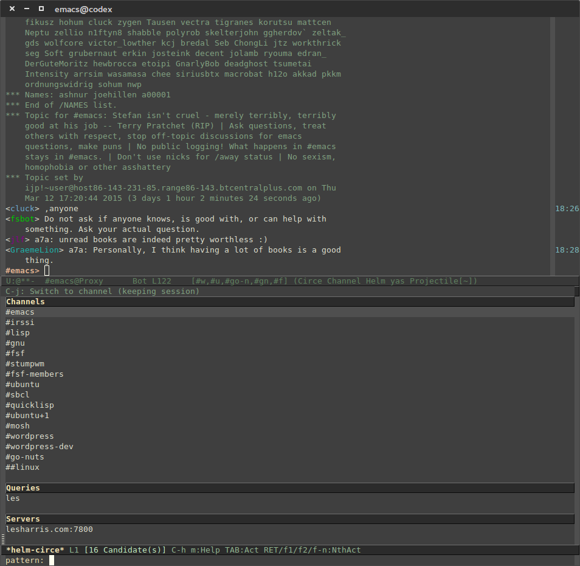

[](http://melpa.org/#/helm-circe)

# helm-circe

Helm bindings for managing circe buffers.

Manage circe buffers easily with Helm.

A call to `helm-circe` will show a list of server, channel, and query
buffers currently open. From the list, you can easily switch to any
particular buffer or close that buffer which will then perform the
correct action server side (e.g.; if you close a channel buffer, circe
will /part you from that channel). Also, helm-circe supports helm
selections so you can select multiple buffers of all types and close
them in bulk if desired.



# Setup

Invoke `helm-circe` and bind it to a keyboard shortcut.

```
(require 'helm-circe)
(global-set-key (kbd "C-c c i") 'helm-circe)
```
